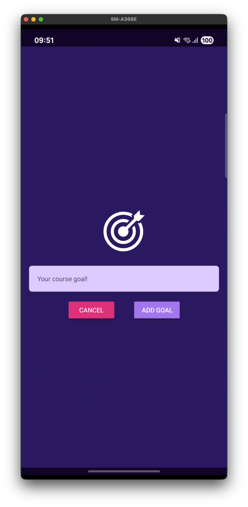

# RNGoalsApp

A simple and intuitive React Native goals tracking application built with Expo.



## Features

- **Add Goals**: Create new goals with a clean modal interface
- **View Goals**: Display all your goals in a scrollable list
- **Delete Goals**: Tap on any goal to remove it from your list
- **Modern UI**: Beautiful purple-themed interface with smooth animations

## Tech Stack

- **React Native** (0.79.6)
- **Expo** (~53.0.22)
- **React** (19.0.0)

## Getting Started

### Prerequisites

- Node.js installed on your machine
- Expo CLI installed globally (`npm install -g @expo/cli`)
- Expo Go app on your mobile device (for testing)

### Installation

1. Clone the repository:

   ```bash
   git clone <repository-url>
   cd RNGoalsApp
   ```

2. Navigate to the app directory:

   ```bash
   cd RNGoalsApp
   ```

3. Install dependencies:
   ```bash
   npm install
   ```

### Running the App

1. Start the development server:

   ```bash
   npm start
   ```

2. Choose your preferred platform:
   - **iOS**: `npm run ios` or scan QR code with Expo Go
   - **Android**: `npm run android` or scan QR code with Expo Go
   - **Web**: `npm run web`

## App Structure

```
RNGoalsApp/
├── App.js                 # Main application component
├── components/
│   ├── GoalInput.js       # Modal component for adding goals
│   └── GoalItem.js        # Individual goal item component
├── assets/
│   └── images/
│       └── goal.png       # Goal icon image
└── package.json          # Dependencies and scripts
```

## How to Use

1. **Adding a Goal**:

   - Tap the "Add New Goal" button
   - Enter your goal text in the modal
   - Tap "Add Goal" to save or "Cancel" to dismiss

2. **Viewing Goals**:

   - All your goals are displayed in a scrollable list
   - Goals appear as purple cards with white text

3. **Deleting a Goal**:
   - Simply tap on any goal to remove it from your list

## Features Overview

- **Modal Interface**: Clean goal input modal with image and text input
- **State Management**: Uses React hooks for managing goals and modal state
- **Responsive Design**: Optimized for both iOS and Android devices
- **Touch Interactions**: Smooth pressable interactions with ripple effects
- **Custom Styling**: Purple-themed UI with modern design elements

## Development

This app demonstrates fundamental React Native concepts including:

- Component composition
- State management with hooks
- Modal navigation
- FlatList for efficient list rendering
- Custom styling with StyleSheet
- Image assets integration

## License

This project is for educational purposes and demonstration of React Native development skills.
